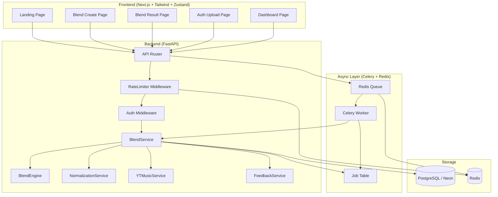
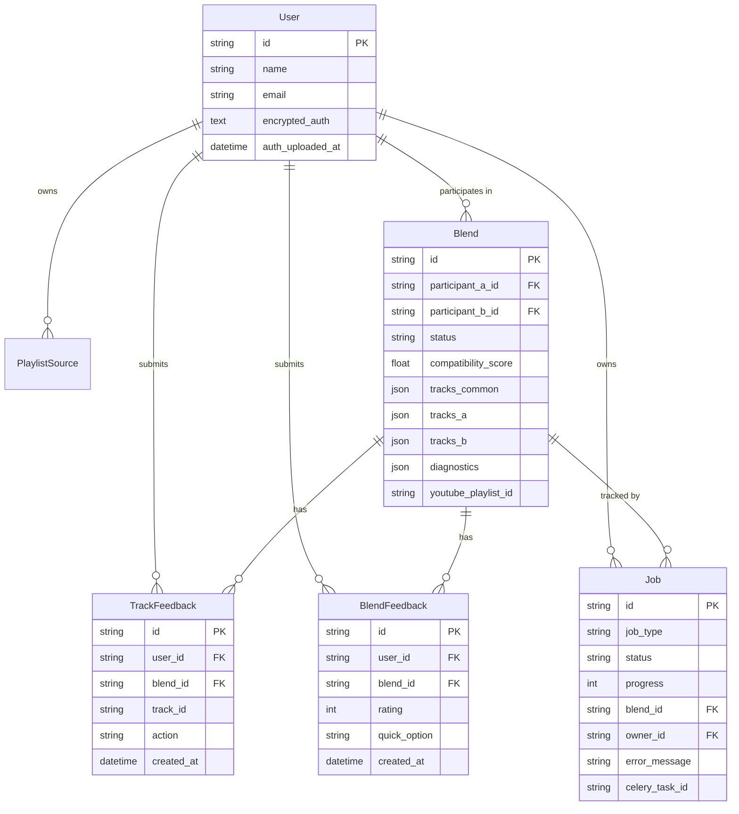

> **SUPERSEDED** — This design doc was written for the initial rebrand. The auth architecture has since changed: `headers_auth.json` upload was removed in favor of Google OAuth only, cross-domain cookies were replaced with Bearer token auth via localStorage, and blend creation now supports Paste Mode + Invite Mode. See `README.md` for the current architecture.

# Design Document — Merge Rebrand & Refactor

## Overview

This document describes the technical design for rebranding "YTMusic Sync" to "Merge" and refactoring the application to match the new product identity. The work spans the full stack: frontend copy and metadata, backend configuration and package naming, data models, API surface, and new capabilities (feedback system, async job tracking, rate limiting, security hardening).

The existing codebase is already well-structured. Most changes are additive or surgical replacements rather than architectural rewrites. The design preserves the current FastAPI + Next.js + PostgreSQL + Celery/Redis stack and extends it with the missing features required by the spec.

### Key Design Decisions

- **Auth provider**: The existing codebase uses `@neondatabase/auth` (Better Auth via Neon) with `neon_auth` schema tables already in the database. The design keeps this provider rather than migrating to Firebase Auth or Clerk, since the schema and session handling are already wired up.
- **Feedback storage**: Track-level and blend-level feedback are stored in two new tables (`track_feedback`, `blend_feedback`) rather than embedded in the `Blend` JSON columns, enabling efficient aggregation queries.
- **Rate limiting**: Implemented as FastAPI middleware using a Redis sliding-window counter, consistent with the existing Redis dependency.
- **Job tracking**: A new `Job` table tracks async task state. Celery tasks write status updates back to this table so the frontend can poll `/job/{job_id}`.
- **Rebrand scope**: All string replacements ("YTMusic Sync" → "Merge") are applied in-place across `layout.tsx`, `config.py`, `pyproject.toml`, `results-panel.tsx`, `tasks.py`, and documentation files.

---

## Architecture



### Request Flow

1. Frontend sends authenticated request (session cookie / Bearer token) to FastAPI.
2. `RateLimiter` middleware checks per-user and per-IP counters in Redis.
3. `AuthMiddleware` validates the session token against the `neon_auth.session` table.
4. Route handler delegates to `BlendService`, which orchestrates `YTMusicService`, `NormalizationService`, `BlendEngine`, and `FeedbackService`.
5. Long-running operations (fetch, generate, export) are dispatched to Celery via Redis. A `Job` record is created and its `job_id` returned to the client immediately.
6. The client polls `GET /job/{job_id}` until status is `done` or `failed`.

---

## Components and Interfaces

### Frontend Components

#### Landing Page (`/`)
- Replaces current hero copy with the new Merge headline and CTAs.
- Removes `brand-spotify` color references; uses `brand-ytmusic` and neutral palette.
- Adds three feature-highlight cards: "Paste links", "Generate blend", "Export to YouTube Music".
- Primary CTA: "Create Merge" → `/blend/create`.
- Secondary CTA: "Login" → `/login`.

#### Blend Form (`/blend/create`)
- Existing `BlendForm` component is largely unchanged.
- Section labels updated: "Listener A" / "Listener B" remain; description copy updated to remove Spotify references.
- Playlist link validation added client-side (YouTube Music URL pattern check before submission).
- Auth upload warning banner added above the file input when `includeLikedSongs` is checked.

#### Results Panel (`/blend/[id]`)
- Export description updated from "YTMusic Sync" to "Merge".
- Track rows gain inline feedback controls (👍 👎 ⏭) visible on hover/tap.
- Blend-level feedback widget (1–5 stars + quick option) rendered below the track list.
- Feedback state managed in `blend-store.ts` alongside existing result state.

#### Sidebar / Layout (`layout.tsx`)
- `<Metadata>` title updated to "Merge".
- Sidebar brand name updated to "Merge".
- GitHub star link updated to new repo slug.
- Tagline updated to "Create playlists from your combined music taste on YouTube Music".

### Backend Services

#### BlendService (`blend_service.py`)
Orchestrates the full blend lifecycle. Existing methods unchanged; new methods added:
- `submit_feedback(payload: TrackFeedbackRequest) -> TrackFeedbackResponse`
- `submit_blend_feedback(payload: BlendFeedbackRequest) -> BlendFeedbackResponse`
- `get_job_status(job_id: str) -> JobStatusResponse`

#### FeedbackService (`feedback_service.py`) — new
Handles storage and aggregation of feedback:
- `record_track_feedback(user_id, blend_id, track_id, action)` — upserts a `TrackFeedback` row.
- `record_blend_feedback(user_id, blend_id, rating, quick_option)` — upserts a `BlendFeedback` row.
- `compute_track_stats(track_id) -> TrackStats` — returns like ratio and skip rate.
- `compute_blend_stats(blend_id) -> BlendStats` — returns average rating and feedback coverage.

#### BlendEngine (`blend_engine.py`)
Existing logic unchanged. One new parameter added to `generate_blend`:
- `feedback_boosts: dict[str, float]` — a map of `normalized_key → boost_delta` derived from the user's feedback history. Applied after scoring: `score += boost_delta`.

#### RateLimiter Middleware (`rate_limiter.py`) — new
FastAPI `BaseHTTPMiddleware` that:
- Extracts `user_id` from the session token (if authenticated) and the client IP.
- Uses Redis `INCR` + `EXPIRE` on keys `rate:user:{user_id}` and `rate:ip:{ip}`.
- Returns `429` with `Retry-After` header when limits are exceeded (60 req/min per user, 100 req/min per IP).

#### AuthMiddleware (`auth_middleware.py`) — new
FastAPI dependency (not middleware) that validates the session token on protected routes:
- Reads `Authorization: Bearer <token>` or the `session` cookie.
- Looks up the token in `neon_auth.session`; checks `expiresAt`.
- Returns `401` for missing or expired tokens.
- Injects `current_user: User` into route handlers.

### API Routes (additions)

| Method | Path | Description |
|--------|------|-------------|
| `POST` | `/feedback/track` | Submit track-level feedback |
| `POST` | `/feedback/blend` | Submit blend-level feedback |
| `GET` | `/job/{job_id}` | Poll async job status |

All existing routes gain the `AuthMiddleware` dependency.

---

## Data Models

### Existing Models (changes only)

**`User`** — no schema changes. `encrypted_auth` and `auth_uploaded_at` fields already present.

**`Blend`** — no schema changes. `tracks_recommended` JSON column already present.

**`PlaylistSource`** — no schema changes.

### New Models

#### `Job`
Tracks the lifecycle of an async Celery task.

```python
class Job(TimestampMixin, Base):
    __tablename__ = "jobs"

    id: Mapped[str]           # UUID, primary key
    job_type: Mapped[str]     # "fetch" | "generate" | "export"
    status: Mapped[str]       # "pending" | "running" | "done" | "failed"
    progress: Mapped[int]     # 0–100
    blend_id: Mapped[str]     # FK → blends.id
    owner_id: Mapped[str]     # FK → neon_auth.user.id
    error_message: Mapped[str | None]
    celery_task_id: Mapped[str | None]
```

#### `TrackFeedback`
Stores per-user, per-track feedback actions within a blend.

```python
class TrackFeedback(TimestampMixin, Base):
    __tablename__ = "track_feedback"

    id: Mapped[str]           # UUID, primary key
    user_id: Mapped[str]      # FK → neon_auth.user.id
    blend_id: Mapped[str]     # FK → blends.id
    track_id: Mapped[str]     # normalized_key of the track
    action: Mapped[str]       # "like" | "dislike" | "skip"
    # Unique constraint: (user_id, blend_id, track_id)
```

#### `BlendFeedback`
Stores per-user blend-level ratings.

```python
class BlendFeedback(TimestampMixin, Base):
    __tablename__ = "blend_feedback"

    id: Mapped[str]           # UUID, primary key
    user_id: Mapped[str]      # FK → neon_auth.user.id
    blend_id: Mapped[str]     # FK → blends.id
    rating: Mapped[int | None]        # 1–5 stars, nullable
    quick_option: Mapped[str | None]  # "accurate" | "missed_vibe", nullable
    # Unique constraint: (user_id, blend_id)
```

### Schema Diagram



---

## Correctness Properties

*A property is a characteristic or behavior that should hold true across all valid executions of a system — essentially, a formal statement about what the system should do. Properties serve as the bridge between human-readable specifications and machine-verifiable correctness guarantees.*

### Property 1: Normalization idempotence

*For any* track title and artist string, applying the normalization pipeline twice should produce the same result as applying it once.

**Validates: Requirements 7.1, 7.2, 7.3, 7.4, 7.5**

---

### Property 2: Deduplication stability

*For any* list of tracks, running `deduplicate_tracks` twice should return the same set of tracks as running it once (idempotence).

**Validates: Requirements 7.6, 7.7**

---

### Property 3: Compatibility score bounds

*For any* two non-empty track lists A and B, the compatibility score produced by `generate_blend` should be a float in the range [0.0, 100.0].

**Validates: Requirements 8.5**

---

### Property 4: Blend section size limits

*For any* two track lists, the total number of tracks across all sections in the generated blend should not exceed 50, and no individual section should contain more than 20 tracks.

**Validates: Requirements 8.6, 8.7**

---

### Property 5: Intersection correctness

*For any* two track lists A and B, every track in the "Shared Taste" section of the generated blend should have a normalized key that appears in both A and B, and no track in the exclusive sections should appear in the shared section.

**Validates: Requirements 8.1, 8.2, 8.3**

---

### Property 6: Playlist link count enforcement

*For any* participant input with more than 5 playlist links, the backend validator should reject the request with a validation error.

**Validates: Requirements 4.1, 4.3**

---

### Property 7: Feedback toggle round-trip

*For any* track feedback action submitted by a user, submitting the same action again should remove it (toggle off), leaving the feedback record absent or cleared.

**Validates: Requirements 11.8**

---

### Property 8: Job status progression

*For any* async job, the status field should only ever transition forward through the sequence `pending → running → done` or `pending → running → failed`; it should never regress to an earlier state.

**Validates: Requirements 10.2, 10.3, 10.4, 10.5**

---

### Property 9: Auth encryption round-trip

*For any* auth headers JSON object uploaded by a user, encrypting and then decrypting the stored value should produce a byte-for-byte equivalent of the original JSON.

**Validates: Requirements 5.2, 5.3, 12.2**

---

### Property 10: Ownership isolation

*For any* blend record, a request authenticated as a user who is neither `participant_a` nor `participant_b` should receive a 403 or 404 response when attempting to read or modify that blend.

**Validates: Requirements 12.5**

---

### Property 11: Rate limit enforcement

*For any* sequence of more than 60 requests within a 60-second window from the same user, all requests beyond the 60th should receive a 429 response.

**Validates: Requirements 12.6**

---

### Property 12: Track feedback storage round-trip

*For any* track feedback submission (user_id, blend_id, track_id, action), querying the feedback store for that (user_id, blend_id, track_id) tuple should return the submitted action.

**Validates: Requirements 11.1, 11.4**

---

### Property 13: Blend feedback storage round-trip

*For any* blend feedback submission (user_id, blend_id, rating, quick_option), querying the feedback store for that (user_id, blend_id) pair should return the submitted rating and quick_option.

**Validates: Requirements 11.2, 11.3, 11.5**

---

## Error Handling

### YTMusicService
- Retries up to 3 times with exponential backoff (1s, 2s, 4s) on any `ytmusicapi` exception.
- After exhausting retries, marks the `PlaylistSource` status as `failed` and records `failure_reason`.
- Tracks missing `videoId`, `title`, or `artist` are silently skipped; the skip count is included in the fetch summary.

### BlendEngine
- If either track list is empty after deduplication, returns a blend with `compatibility_score = 0.0` and empty sections rather than raising.
- Score computation is purely arithmetic; no external I/O, so no retry logic needed.

### Export Pipeline
- Individual track match failures are logged and skipped; the export continues.
- If zero tracks are validated, raises `ValueError("No playable tracks")` which the route handler converts to a `400`.
- The `youtube_playlist_id` is written to the `Blend` record only after the playlist is successfully created.

### Auth Middleware
- Missing token → `401 Unauthorized`.
- Expired session → `401 Unauthorized` with `WWW-Authenticate: Bearer error="invalid_token"`.
- Valid token but user not found → `401 Unauthorized`.

### Rate Limiter
- Per-user limit exceeded → `429 Too Many Requests` with `Retry-After: 60`.
- Per-IP limit exceeded → `429 Too Many Requests` with `Retry-After: 60`.
- Redis unavailable → fail open (allow request, log warning) to avoid taking down the API.

### Feedback Service
- Duplicate feedback submission (same user + blend + track) → upsert, not error.
- Invalid `action` value → `422 Unprocessable Entity` from Pydantic validation.
- Invalid `rating` outside 1–5 → `422 Unprocessable Entity`.

### Frontend
- API errors surface via the existing `ApiError` class and are displayed in the relevant form's error state.
- Job polling uses exponential backoff (1s, 2s, 4s, 8s, max 10s) and stops after 10 minutes or on terminal status.

---

## Testing Strategy

### Unit Tests

Focus on specific examples, edge cases, and error conditions:

- `test_normalize_title`: known noisy titles → expected clean output.
- `test_normalize_artist`: featuring credits, special characters → primary artist only.
- `test_deduplicate_tracks`: exact duplicates, near-duplicates at threshold boundary.
- `test_generate_blend_empty_inputs`: one or both lists empty.
- `test_compatibility_score_identical_lists`: score should be 100.
- `test_section_limits`: inputs that would exceed 50 total / 20 per section.
- `test_extract_playlist_id`: valid URLs, bare IDs, malformed URLs.
- `test_rate_limiter_allows_under_limit`: 59 requests → all pass.
- `test_rate_limiter_blocks_at_limit`: 61st request → 429.
- `test_auth_middleware_missing_token`: no header → 401.
- `test_auth_middleware_expired_token`: expired session → 401.
- `test_feedback_toggle`: submit like, submit like again → record absent.
- `test_job_status_transitions`: valid transitions only.

### Property-Based Tests

Use **Hypothesis** (Python) for backend properties and **fast-check** (TypeScript) for frontend properties. Each test runs a minimum of 100 iterations.

#### Backend (Hypothesis)

```
# Feature: merge-rebrand-refactor, Property 1: Normalization idempotence
@given(st.text(), st.text())
def test_normalization_idempotence(title, artist):
    once = build_normalized_key(title, artist)
    twice = build_normalized_key(*once.split("::"))  # re-normalize the output
    assert once == twice
```

```
# Feature: merge-rebrand-refactor, Property 2: Deduplication stability
@given(st.lists(track_strategy()))
def test_deduplication_idempotence(tracks):
    once = deduplicate_tracks(tracks)
    twice = deduplicate_tracks(once)
    assert [t.normalized_key for t in once] == [t.normalized_key for t in twice]
```

```
# Feature: merge-rebrand-refactor, Property 3: Compatibility score bounds
@given(st.lists(track_strategy(), min_size=1), st.lists(track_strategy(), min_size=1))
def test_compatibility_score_bounds(tracks_a, tracks_b):
    result = generate_blend(tracks_a, tracks_b)
    assert 0.0 <= result["compatibility_score"] <= 100.0
```

```
# Feature: merge-rebrand-refactor, Property 4: Blend section size limits
@given(st.lists(track_strategy()), st.lists(track_strategy()))
def test_blend_section_limits(tracks_a, tracks_b):
    result = generate_blend(tracks_a, tracks_b)
    total = sum(len(s.tracks) for s in result["sections"])
    assert total <= 50
    assert all(len(s.tracks) <= 20 for s in result["sections"])
```

```
# Feature: merge-rebrand-refactor, Property 5: Intersection correctness
@given(st.lists(track_strategy(), min_size=1), st.lists(track_strategy(), min_size=1))
def test_intersection_correctness(tracks_a, tracks_b):
    result = generate_blend(tracks_a, tracks_b)
    keys_a = {t.normalized_key for t in deduplicate_tracks(tracks_a)}
    keys_b = {t.normalized_key for t in deduplicate_tracks(tracks_b)}
    shared_section = result["sections"][0]
    for track in shared_section.tracks:
        assert track.normalized_key in keys_a
        assert track.normalized_key in keys_b
```

```
# Feature: merge-rebrand-refactor, Property 9: Auth encryption round-trip
@given(st.dictionaries(st.text(), st.text()))
def test_auth_encryption_round_trip(headers):
    encrypted = encrypt_auth(headers)
    decrypted = decrypt_auth(encrypted)
    assert decrypted == headers
```

```
# Feature: merge-rebrand-refactor, Property 12 & 13: Feedback storage round-trips
@given(feedback_strategy())
def test_track_feedback_round_trip(feedback):
    record_track_feedback(feedback)
    stored = get_track_feedback(feedback.user_id, feedback.blend_id, feedback.track_id)
    assert stored.action == feedback.action

@given(blend_feedback_strategy())
def test_blend_feedback_round_trip(feedback):
    record_blend_feedback(feedback)
    stored = get_blend_feedback(feedback.user_id, feedback.blend_id)
    assert stored.rating == feedback.rating
    assert stored.quick_option == feedback.quick_option
```

Properties 6, 7, 8, 10, and 11 are validated through integration tests using a test database and a mock Redis client, since they involve HTTP request/response cycles and stateful middleware.

### Integration Tests

- Full blend creation flow: create → fetch → generate → assert sections non-empty.
- Export flow: generate → export → assert `youtube_playlist_id` set on blend.
- Auth upload: upload valid JSON → assert `encrypted_auth` non-null in DB.
- Rate limiter: 61 sequential requests from same user → assert 61st is 429.
- Ownership check: user B requests user A's blend → assert 403/404.
