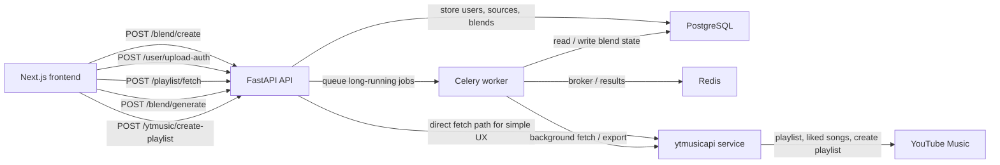

# YTMusic Sync

YTMusic Sync is a private full-stack web app for generating a shared "blend" playlist from YouTube Music data.

It is designed around a narrow workflow:

- each listener pastes up to 5 playlist links
- advanced users can optionally attach `headers_auth.json`
- the backend fetches tracks with `ytmusicapi`
- tracks are normalized, deduplicated, and fuzzy matched
- a three-part blend is generated
- one listener can push the final playlist back to YouTube Music

## Product Intent

The app is aimed at non-technical users who want a low-friction way to compare taste and build a shared private playlist without manually cleaning track lists.

## Stack

- Frontend: Next.js + TailwindCSS + Zustand
- Backend: FastAPI + SQLAlchemy
- Database: PostgreSQL
- Async jobs: Celery + Redis
- Music integration: `ytmusicapi`

## Documentation Map

- [README.md](./README.md): product overview, architecture, local setup, and quick deployment notes
- [DEPLOYMENT.md](./DEPLOYMENT.md): step-by-step Vercel deployment guide with environment variables and smoke checks
- [CONTRIBUTING.md](./CONTRIBUTING.md): contribution workflow, quality bar, and pull request checklist
- [SECURITY.md](./SECURITY.md): secrets handling, auth upload expectations, and vulnerability reporting
- [code_review.md](./code_review.md): collaborator-focused technical review and current risk areas

## Architecture



## Main Flow

1. The frontend collects two listeners and their sources.
2. `POST /blend/create` creates users, playlist sources, and an empty blend record.
3. Optional auth files are uploaded and encrypted before storage.
4. `POST /playlist/fetch` fetches playlist tracks and liked songs.
5. The backend normalizes titles and artists, strips noisy suffixes, deduplicates tracks, and uses fuzzy matching for near duplicates.
6. `POST /blend/generate` computes:
   - shared tracks
   - user A recommendations
   - user B recommendations
   - compatibility score
7. `POST /ytmusic/create-playlist` creates a private playlist and pushes validated track ids.

## Blend Engine

The blend engine currently follows the spec closely:

- Shared Taste: exact intersection on normalized track keys
- From User A: unique tracks from listener A ranked for fit
- From User B: unique tracks from listener B ranked for fit

### Normalization Rules

- lowercase title and artist
- strip noisy bracket content like `official video`, `audio`, `lyrics`, `remastered`
- trim whitespace
- generate a stable `normalizedKey`
- fuzzy compare title and artist pairs using `rapidfuzz`

### Recommendation Scoring

Each unique track is scored using:

```text
score = (0.5 * overlap_ratio) +
        (0.3 * artist_similarity) +
        (0.2 * diversity_factor)
```

This keeps the blend from collapsing into either:

- only pure overlap tracks
- or a random pile of unrelated unique songs

## API Surface

### Required endpoints

- `GET /`
- `GET /health`
- `POST /blend/create`
- `POST /user/upload-auth`
- `POST /playlist/fetch`
- `GET /blend/{id}`
- `POST /blend/generate`
- `POST /ytmusic/create-playlist`

### Practical shape

- `/` returns a simple backend-ready status payload
- `/health` returns the smoke-test health check
- `/blend/create` persists listeners and source references
- `/user/upload-auth` accepts multipart JSON upload and encrypts it
- `/playlist/fetch` can run synchronously for the simple UI path or asynchronously through Celery
- `/blend/generate` materializes final sections into the `blends` table
- `/ytmusic/create-playlist` validates video ids before export

## Repository Layout

```text
.
|-- backend/
|   |-- app/
|   |   |-- api/
|   |   |-- core/
|   |   |-- db/
|   |   |-- schemas/
|   |   |-- services/
|   |   |-- main.py
|   |   |-- models.py
|   |   `-- tasks.py
|   |-- tests/
|   |-- .env.example
|   |-- pyproject.toml
|   `-- vercel.json
|-- frontend/
|   |-- src/
|   |   |-- app/
|   |   |-- components/
|   |   |-- lib/
|   |   |-- store/
|   |   `-- types/
|   |-- .env.example
|   |-- package.json
|   `-- tailwind.config.ts
|-- CONTRIBUTING.md
|-- DEPLOYMENT.md
|-- LICENSE
|-- SECURITY.md
|-- code_review.md
`-- README.md
```

## Local Development

### Prerequisites

- Node.js 20+
- Python 3.11+
- Docker Desktop or local PostgreSQL + Redis

### Environment

Copy `backend/.env.example` to `backend/.env` and `frontend/.env.example` to `frontend/.env.local`.

The root [`./.env.example`](./.env.example) is only a quick reference. The app-specific files above are the files that should actually be copied.

Set the main values first:

- `DATABASE_URL`
- `REDIS_URL`
- `SECRET_KEY`
- `FRONTEND_URL`
- `NEXT_PUBLIC_API_BASE_URL`
- `NEON_AUTH_BASE_URL`
- `NEON_AUTH_COOKIE_SECRET`

The frontend value should point at the backend root domain. If you accidentally include a trailing `/api`, the frontend strips it before making requests.
The Neon Auth values are used by the frontend auth handler and are separate from the backend `SECRET_KEY`.

### Start infrastructure

```bash
docker compose up -d
```

### Start backend

```bash
cd backend
pip install -e ".[dev]"
uvicorn app.main:app --reload
```

### Start worker

```bash
cd backend
celery -A app.tasks worker --loglevel=info
```

### Start frontend

```bash
cd frontend
npm install
npm run dev
```

## Security Notes

- uploaded auth headers are encrypted before storage
- raw auth payloads should never be logged
- liked songs import is only enabled when auth exists
- playlist export requires a valid auth file for one listener
- the app is intended to run behind HTTPS in deployment

## Known Gaps

This repository is scaffolded end to end, but some production follow-up work is still expected:

- add Alembic migrations instead of `create_all`
- add auth or session ownership around blend access
- add richer retry policies and job progress tracking
- add end-to-end tests once runtime tooling is installed
- tune fuzzy matching and export validation against real user libraries

## Vercel Deployment

Deploy the frontend and backend as two separate Vercel projects.

For the full deployment checklist, see [DEPLOYMENT.md](./DEPLOYMENT.md).

### Frontend project

- Root Directory: `frontend`
- Framework Preset: `Next.js`
- Required Environment Variables:
  - `NEXT_PUBLIC_API_BASE_URL=https://your-backend-domain.vercel.app`
  - `NEON_AUTH_BASE_URL=https://your-neon-auth-base-url`
  - `NEON_AUTH_COOKIE_SECRET=replace-with-a-long-random-secret`

### Backend project

- Root Directory: `backend`
- Framework Preset: `Other`
- Request routing: `backend/vercel.json` rewrites all requests to `app/main.py`
- Required Environment Variables:
  - `DATABASE_URL`
  - `REDIS_URL`
  - `SECRET_KEY`
  - `FRONTEND_URL=https://your-frontend-domain.vercel.app`
  - `DEBUG=false`
- Optional tuning variables:
  - `MAX_PLAYLIST_LINKS`
  - `LIKED_SONGS_LIMIT`
  - `TOTAL_TRACKS_LIMIT`
  - `MAX_TRACKS_PER_SECTION`
  - `YTMUSIC_RETRY_ATTEMPTS`

### Smoke checks after deploy

- Frontend should load without a `/favicon.ico` 404.
- Backend root `/` should return basic service metadata.
- Backend `/health` should return `{"status":"ok"}`.

## Notes For Collaborators

- `code_review.md` explains the structure and current technical risks
- the current codebase was scaffolded in a workspace where `node`, `npm`, and `python` were not exposed in shell, so installs and runtime verification still need to be done on a machine with those toolchains available

## Contributing

Contribution workflow, quality expectations, and commit guidance live in [CONTRIBUTING.md](./CONTRIBUTING.md).

## Security

Secrets handling and responsible disclosure notes live in [SECURITY.md](./SECURITY.md).

## License

This repository is licensed under the MIT License. See [LICENSE](./LICENSE).
