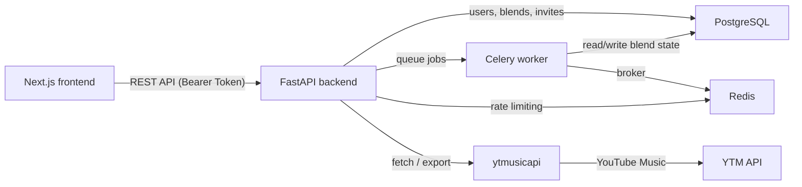

# Merge

[](https://github.com/Erebuzzz/merge-ytm)

Merge generates shared playlists from the combined YouTube Music taste of two listeners. It finds what you both love, surfaces compatible picks from each side, and adds algorithmic discoveries neither of you knew yet.

Free, open-source, and community-driven.

## What it does

- **Paste Mode**: One listener pastes up to 5 YouTube Music playlist links for themselves and their friend.
- **Invite Mode**: A listener connects their YouTube Music, generates an invite link, and sends it to a friend. The friend connects and joins on their own device.
- The backend fetches tracks via `ytmusicapi`, normalizes and deduplicates them, then scores the blend.
- The result is a three-section playlist: shared taste, picks from each listener, and new discoveries.
- Any participant can push the final playlist directly to their YouTube Music library.

## Stack

| Layer | Tech |
|---|---|
| Frontend | Next.js 15, TailwindCSS, Zustand |
| Backend | FastAPI, SQLAlchemy |
| Database | PostgreSQL (Neon) |
| Async jobs | Celery + Redis |
| Auth | Neon Auth (Better Auth) with URL token exchange |
| Music | `ytmusicapi` |

## Deployment

| Backend API & Worker | Render (free single-container via start.sh) |
| Redis | Upstash (free) |
| PostgreSQL | Neon (free) |

## Documentation

- [README.md](./README.md) — product overview, architecture, local setup
- [DEPLOYMENT.md](./DEPLOYMENT.md) — Render + Upstash + Vercel deployment guide
- [CONTRIBUTING.md](./CONTRIBUTING.md) — contribution workflow and PR checklist
- [SECURITY.md](./SECURITY.md) — secrets handling and vulnerability reporting
- [code_review.md](./code_review.md) — technical review and known risk areas

## Architecture



## Request flow

1. `RateLimiter` middleware checks per-user (60 req/min) and per-IP (100 req/min) counters in Redis.
2. `AuthMiddleware` validates the session token against `neon_auth.session`. The token is passed via `Authorization: Bearer` header.
3. Route handler delegates to `BlendService`, which orchestrates `YTMusicService`, `NormalizationService`, `BlendEngine`, and `FeedbackService`.
4. Long-running operations (fetch, generate, export) are dispatched to Celery. A `Job` record is created and its `job_id` returned immediately.
5. The client polls `GET /job/{job_id}` with exponential backoff until `done` or `failed`.
6. Background tasks and broker state are monitored via the independent **Flower dashboard**.

## Blend engine

### Sections

| Section | Description |
|---|---|
| Shared Taste | Exact intersection on normalized track keys |
| From User A | Unique tracks from listener A, ranked by compatibility |
| From User B | Unique tracks from listener B, ranked by compatibility |
| New Discoveries | Algorithmic radio picks seeded from shared tracks |

Limits: 50 tracks total, 20 per section.

### Normalization

- NFKD unicode normalization + lowercase
- Strip bracket noise: `official video`, `audio`, `lyrics`, `remastered`, etc.
- Normalize featuring credits and special symbols
- Trim whitespace
- Fuzzy match title + artist pairs with `rapidfuzz`

### Scoring formula

```
score = (0.5 × overlap_ratio)
      + (0.3 × artist_similarity)
      + (0.2 × diversity_factor)
      + frequency_weight
```

Feedback boosts are applied on top: liked tracks get `+10`, disliked `−10`, skipped `−5`.

### Compatibility score

```
compatibility = 2 × |shared| / (|A| + |B|) × 100
```

## API surface

| Method | Path | Description |
|---|---|---|
| `GET` | `/` | Health / status |
| `GET` | `/health` | Smoke check |
| `GET` | `/auth/youtube/url` | Get Google OAuth URL for YouTube Music |
| `GET` | `/auth/youtube/callback` | OAuth callback — token is passed back to frontend via URL |
| `GET` | `/user/youtube-status` | Check if user has connected YouTube Music |
| `GET` | `/user/playlists` | List user's YouTube Music library playlists |
| `GET` | `/user/liked-songs/count` | Count of liked songs |
| `POST` | `/invite/create` | Create a blend invite |
| `GET` | `/invite/{code}` | Get blend invite details |
| `POST` | `/invite/{code}/join` | Join a blend invite |
| `POST` | `/blend/create` | Create blend record (solo paste mode) |
| `POST` | `/playlist/fetch` | Fetch playlist tracks |
| `GET` | `/blend/{id}` | Get blend detail |
| `POST` | `/blend/generate` | Generate blend sections (idempotent) |
| `POST` | `/blend/generate/async` | Dispatch async generation (duplicate-safe) |
| `POST` | `/ytmusic/create-playlist` | Export to YouTube Music |
| `GET` | `/job/{job_id}` | Poll async job status |
| `POST` | `/feedback/track` | Submit track feedback |
| `POST` | `/feedback/blend` | Submit blend rating |

All routes except `GET /`, `GET /health`, and `GET /auth/youtube/callback` require authentication.

## Local development

### Prerequisites

- Node.js 20+
- Python 3.11+
- Docker Desktop (or local PostgreSQL + Redis)

### Environment setup

```bash
cp backend/.env.example backend/.env
cp frontend/.env.example frontend/.env.local
```

Required values:

| Variable | Where |
|---|---|
| `DATABASE_URL` | backend |
| `REDIS_URL` | backend |
| `SECRET_KEY` | backend |
| `FRONTEND_URL` | backend |
| `NEXT_PUBLIC_API_BASE_URL` | frontend |
| `NEON_AUTH_BASE_URL` | frontend |
| `NEON_AUTH_COOKIE_SECRET` | frontend |

The frontend strips a trailing `/api` from `NEXT_PUBLIC_API_BASE_URL` automatically.

Neon Auth requires each frontend origin to be trusted. Add `http://localhost:3000`, your production URL, and any active preview URLs to Neon Auth trusted origins.

### Start infrastructure

```bash
docker compose up -d
```

### Start backend

```bash
cd backend
pip install -e ".[dev]"
uvicorn app.main:app --reload
```

### Start Celery worker

```bash
cd backend
celery -A app.tasks worker --loglevel=info
```

### Start frontend

```bash
cd frontend
npm install
npm run dev
```

## YouTube Music connection

Merge uses Google OAuth linked to ytmusicapi to authenticate on behalf of the user.

- Auth tokens are encrypted with Fernet (AES-128-CBC) before storage — plaintext is never persisted.
- If a user doesn't want to connect Google OAuth, they can still Paste public playlist URLs.
- All API routes require a valid session token passed via `Authorization: Bearer <token>`.
- See [SECURITY.md](./SECURITY.md) for full details.

## Deployment

The app deploys across four free platforms. See [DEPLOYMENT.md](./DEPLOYMENT.md) for the full step-by-step guide.

**Keep Render awake:** Render free services sleep after 15 minutes of inactivity. Set up a free [UptimeRobot](https://uptimerobot.com) monitor pointing at `https://your-app.onrender.com/health` with a 5-minute interval to keep it alive 24/7.

## Contributing

See [CONTRIBUTING.md](./CONTRIBUTING.md).

## License

MIT — see [LICENSE](./LICENSE).
