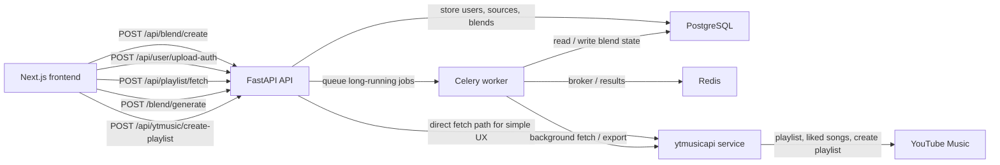

# YTMusic Sync

YTMusic Sync is a private full-stack web app for generating a shared "blend" playlist from YouTube Music data.

It is designed around a very narrow workflow:

- each listener pastes up to 5 playlist links
- advanced users can optionally attach `headers_auth.json`
- the backend fetches tracks with `ytmusicapi`
- tracks are normalized, deduplicated, and fuzzy matched
- a three-part blend is generated
- one listener can push the final playlist back to YouTube Music

## Product Intent

The app is aimed at non-technical users who want a low-friction way to compare taste and build a shared private playlist without manually cleaning track lists.

## Stack

- Frontend: Next.js + TailwindCSS + Zustand
- Backend: FastAPI + SQLAlchemy
- Database: PostgreSQL
- Async jobs: Celery + Redis
- Music integration: `ytmusicapi`

## Architecture



## Main Flow

1. The frontend collects two listeners and their sources.
2. `POST /api/blend/create` creates users, playlist sources, and an empty blend record.
3. Optional auth files are uploaded and encrypted before storage.
4. `POST /api/playlist/fetch` fetches playlist tracks and liked songs.
5. The backend normalizes titles and artists, strips noisy suffixes, deduplicates tracks, and uses fuzzy matching for near duplicates.
6. `POST /blend/generate` computes:
   - shared tracks
   - user A recommendations
   - user B recommendations
   - compatibility score
7. `POST /api/ytmusic/create-playlist` creates a private playlist and pushes validated track ids.

## Blend Engine

The blend engine currently follows the spec closely:

- Shared Taste: exact intersection on normalized track keys
- From User A: unique tracks from listener A ranked for fit
- From User B: unique tracks from listener B ranked for fit

### Normalization Rules

- lowercase title and artist
- strip noisy bracket content like `official video`, `audio`, `lyrics`, `remastered`
- trim whitespace
- generate a stable `normalizedKey`
- fuzzy compare title and artist pairs using `rapidfuzz`

### Recommendation Scoring

Each unique track is scored using:

```text
score = (0.5 * overlap_ratio) +
        (0.3 * artist_similarity) +
        (0.2 * diversity_factor)
```

This keeps the blend from collapsing into either:

- only pure overlap tracks
- or a random pile of unrelated unique songs

## API Surface

### Required endpoints

- `POST /api/blend/create`
- `POST /api/user/upload-auth`
- `POST /api/playlist/fetch`
- `GET /blend/{id}`
- `POST /blend/generate`
- `POST /api/ytmusic/create-playlist`

### Practical shape

- `/api/blend/create` persists listeners and source references
- `/api/user/upload-auth` accepts multipart JSON upload and encrypts it
- `/api/playlist/fetch` can run synchronously for the simple UI path or asynchronously through Celery
- `/blend/generate` materializes final sections into the `blends` table
- `/api/ytmusic/create-playlist` validates video ids before export

## Repository Layout

```text
.
├─ backend/
│  ├─ app/
│  │  ├─ api/
│  │  ├─ core/
│  │  ├─ db/
│  │  ├─ schemas/
│  │  ├─ services/
│  │  ├─ main.py
│  │  ├─ models.py
│  │  └─ tasks.py
│  ├─ tests/
│  └─ pyproject.toml
├─ frontend/
│  ├─ src/
│  │  ├─ app/
│  │  ├─ components/
│  │  ├─ lib/
│  │  ├─ store/
│  │  └─ types/
│  ├─ package.json
│  └─ tailwind.config.ts
├─ docker-compose.yml
├─ code_review.md
└─ README.md
```

## Local Development

### Prerequisites

- Node.js 20+
- Python 3.11+
- Docker Desktop or local PostgreSQL + Redis

### Environment

Copy `.env.example` to `.env` and set:

- `DATABASE_URL`
- `REDIS_URL`
- `SECRET_KEY`
- `FRONTEND_URL`
- `NEXT_PUBLIC_API_BASE_URL`

### Start infrastructure

```bash
docker compose up -d
```

### Start backend

```bash
cd backend
pip install -e ".[dev]"
uvicorn app.main:app --reload
```

### Start worker

```bash
cd backend
celery -A app.tasks worker --loglevel=info
```

### Start frontend

```bash
cd frontend
npm install
npm run dev
```

## Security Notes

- uploaded auth headers are encrypted before storage
- raw auth payloads should never be logged
- liked songs import is only enabled when auth exists
- playlist export requires a valid auth file for one listener
- the app is intended to run behind HTTPS in deployment

## Known Gaps

This repository is now scaffolded end to end, but some production follow-up work is still expected:

- add Alembic migrations instead of `create_all`
- add auth or session ownership around blend access
- add richer retry policies and job progress tracking
- add end-to-end tests once runtime tooling is installed
- tune fuzzy matching and export validation against real user libraries

## Deployment Direction

- Frontend: Vercel
- Backend: Railway or Render
- Database: Neon or Supabase PostgreSQL
- Redis: Railway, Upstash Redis, or Render Redis

## Notes For Collaborators

- `code_review.md` explains the structure and current technical risks
- the current codebase was scaffolded in a workspace where `node`, `npm`, and `python` were not exposed in shell, so installs and runtime verification still need to be done on a machine with those toolchains available
